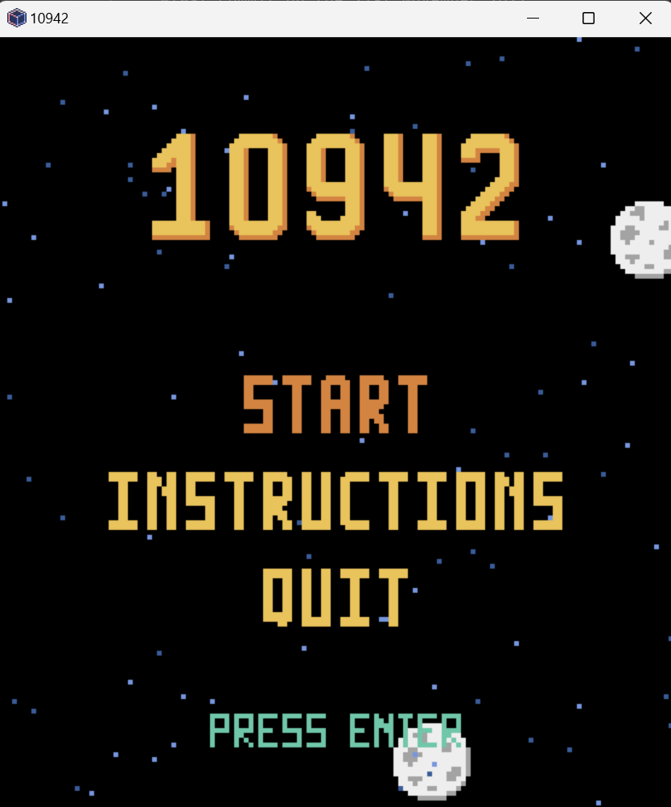
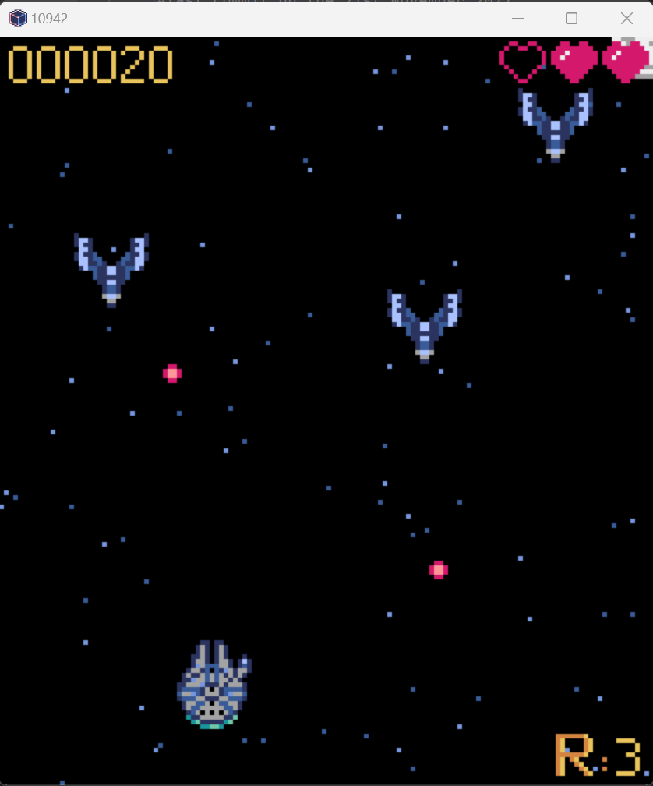

# 10942-the-Game
## an Arcade Retro shooting Python game inspired by Star Wars.
Authors: Hugo Centeno & Pablo Ruíz

Last commit 21st November 2022

- ### About 10942
  10942 is a version of the arcade game 1942 by Capcom inspired by Star Wars.
  
  This project was made with the intention of learning OOP and Python programming.

- ### How to play?
  Avoid hordes of enemy spaceships, grab power-ups to improve your starship and defeat the Empire!

- ### Instructions
  -*WASD* to move
  
  -*space* to shoot
  
  -*Z* to loop

- ### Gameplay
  

  
